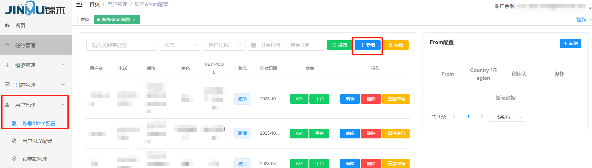
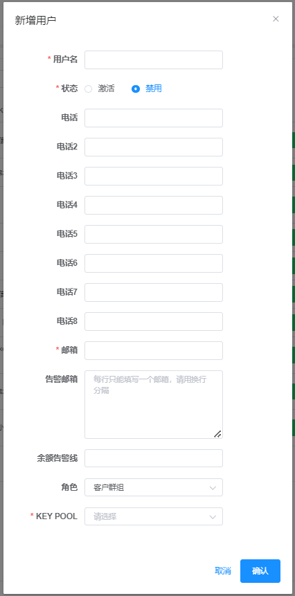
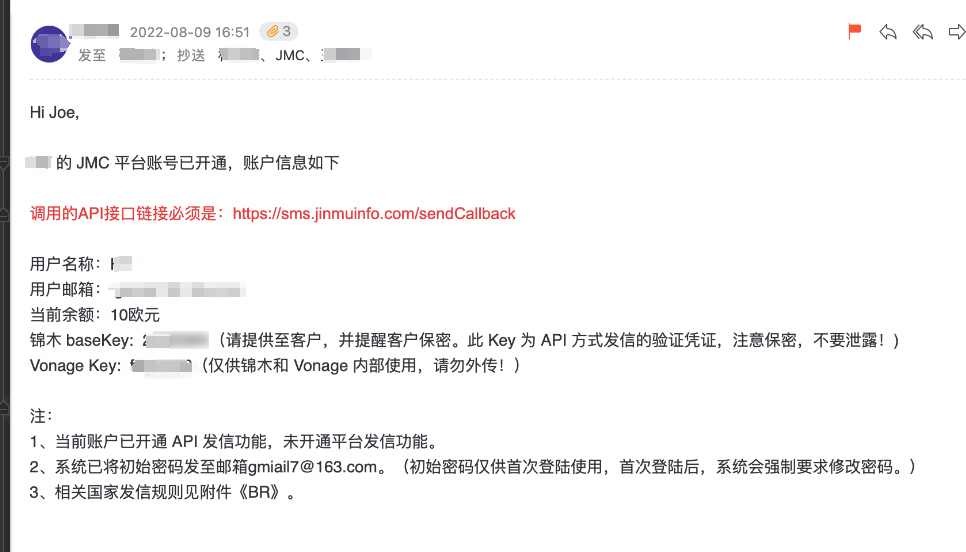

## 开通客户账号

__登录JMC平台,左侧`用户管理->账号&from配置`__

点击新增按钮为客户开通账号

__填写客户账号相关信息__

账号只能绑定一个邮箱,可绑定多个手机号码。客户的账号开通后可凭借此处绑定的邮箱和手机号吗作为账号登录。
账号的初始密码会以邮件的形式发送到此处填写的邮箱中,初次登录要求修改初始密码。
KEYPOOL的配置关系到此账户的发信功能,在配置池组时进行详细说明。

__JMC与VONAGE的账号都开通完毕,也配置完毕,发送邮件通知相关人员__

相关人员:JMC群组、客户、客户对接销售（注意邮件内容需要相应调整）

