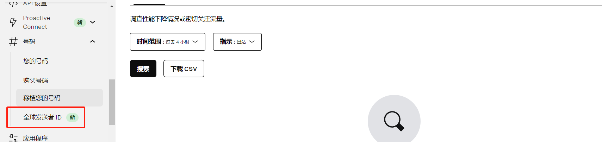
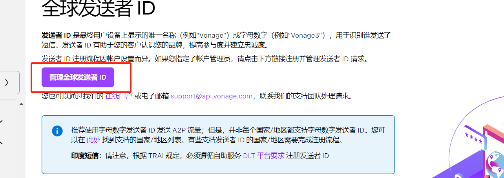
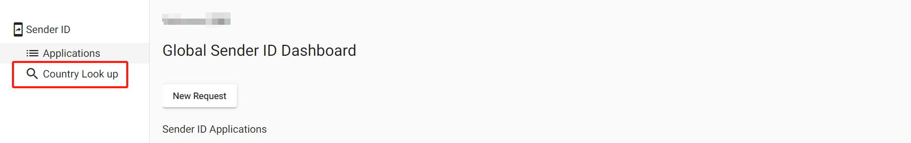
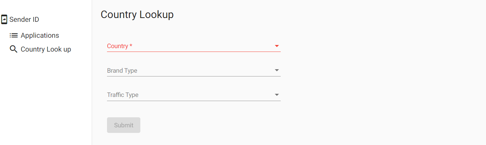
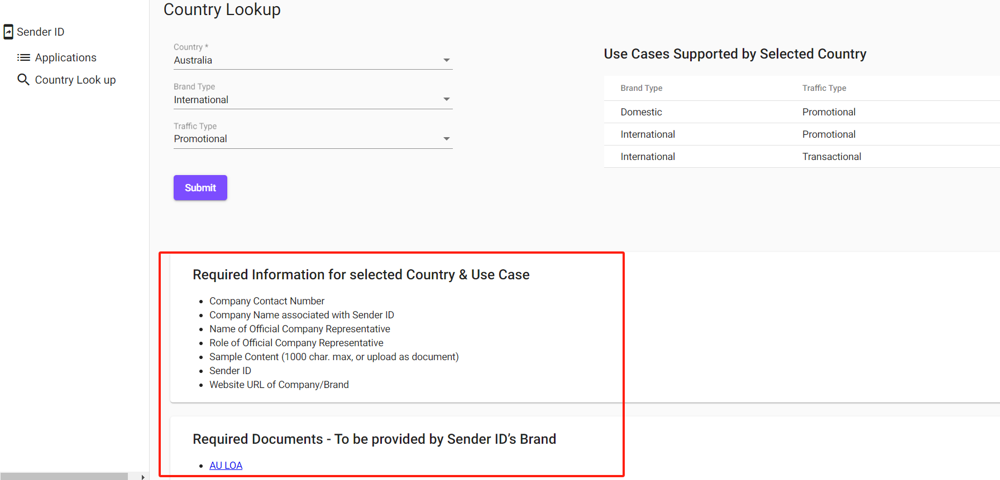
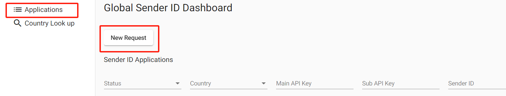
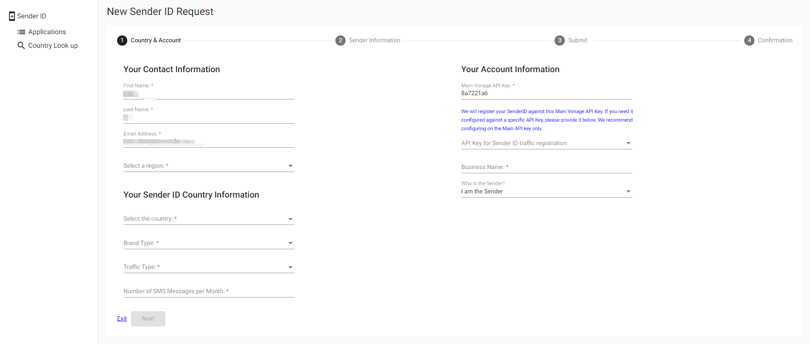
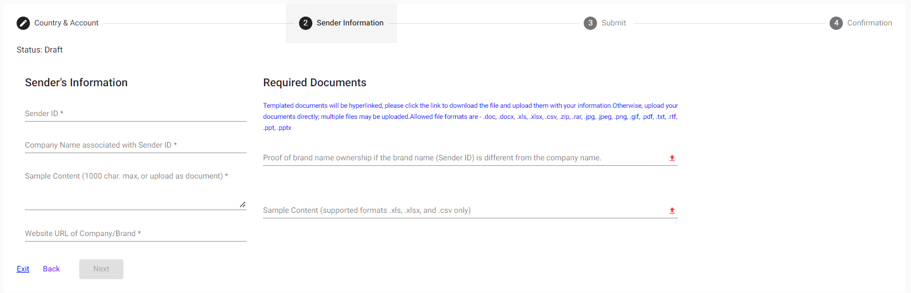
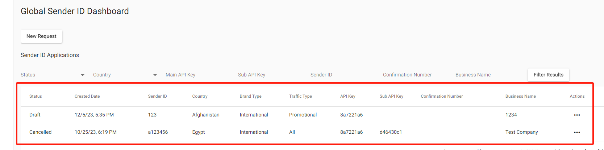

## 申请SenderID

__登录Vonage控制台,左侧菜单栏找到`号码->全球发送者ID`__

__选择管理全球发送者ID__

__选择CountryLookUp__

__三个选项供筛选__

1. Country:选择发信国家
2. BrandType:选择品牌类型（Domestic（本地）/International（国际））
3. TrafficType:通道类型（Transactional（交易）/Promotional（营销））

__以澳大利亚为例点击Submit后会给出申请所需材料和信息__

注:申请信息前请查看对应国家/地区的发信规则，如有疑问联系对接客户的Vonage销售咨询

__发起申请__

点击左侧Application,选择NEW REQUEST发起申请

__填写申请所需基本信息__

__一些信息需要客户提供__

1. SenderID:SenderID的具体内容值由客户决定
2. 关联的客户公司名称
3. SMS内容样例
4. 公司品牌的网站URL
5. 额外文件（SMS内容样例文件、品牌所有权证明文件（该项如果SenderID要以客户的品牌为准,这时如果品牌与公司名称不一致则需要该证明文件））

__提交完上述信息后,点击下一步确认信息直至提交,等待申请结果__

__草稿及正式申请可在如下列表查看__

